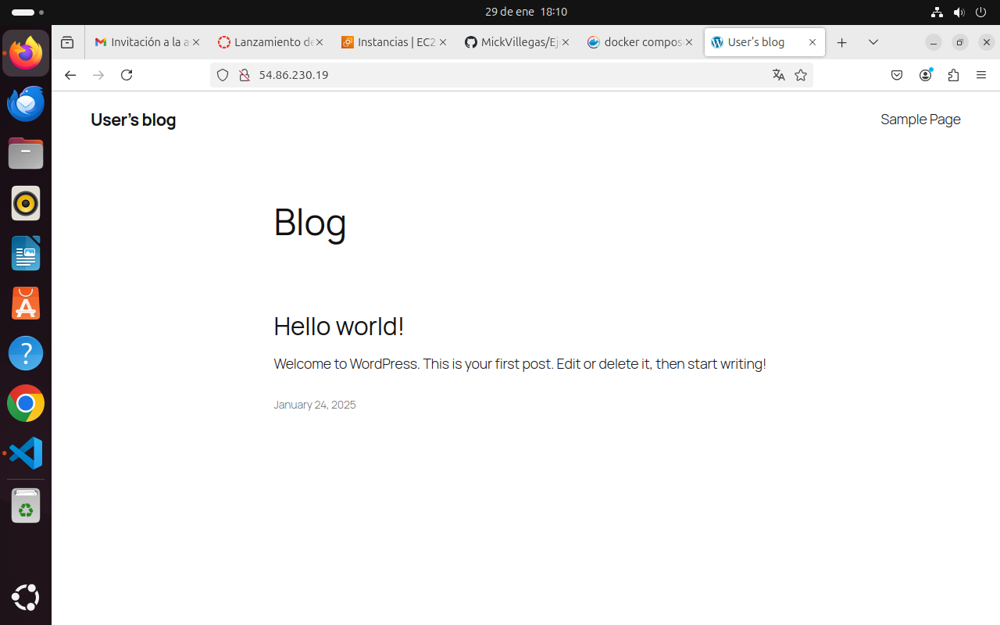

# Despliegue de wordpress en Docker

En este ejercicio haremos uso de los servicios mysql, phpadmin, http y wordpress que iran bajo la palabra service, bayamos primero con mysql  

## Mysql
La configuracion para mysql será el siguiente  

```
 mysql:
    image: mysql:9.0
    ports: 
      - 3306:3306
    environment: 
      - MYSQL_ROOT_PASSWORD=$MYSQL_ROOT_PASSWORD
      - MYSQL_DATABASE=$MYSQL_DATABASE
      - MYSQL_USER=$MYSQL_USER
      - MYSQL_PASSWORD=$MYSQL_PASSWORD
    volumes: 
      - mysql_data:/var/lib/mysql
    networks: 
      - backend-network
    restart: always
```

donde  image: mysql:9.0 es la version de la imagen mysql, la version que se usará es la version 9.0, en  ports: - 3306:3306 especificamos el puerto que va a usar, en este caso el 3306:3306, en environment: le pasamos las variables de entorno donde le pasaremos la contraseña root, el nombre de base de datos, el usuario y la contraseña, para pasarle las variables de entorno en un archivo .env suaremos como siempre el simbolo del dolar y el nombre de la variable. Despues bienen los volumenes, que es donde se almacenaran de forma permanente los datos, tras esto en networks: que es la red con la que se conectará, esn esta vez se conectará en el backend, por ultimo nos encontramos con restart always, que indica que mmysql siempre se reiniciará automaticamente

## phpmyadmin
El codigo de php es el siguiente  

```
  phpmyadmin:
    image: phpmyadmin:5.2.1
    ports:
      - 8080:80
    environment: 
      - PMA_ARBITRARY=1
    networks: 
      - backend-network
      - frontend-network
    restart: always
    depends_on: 
      - mysql
```
Usaremos la version 5.2.1 de la imagen, los puertos que usara será el 8080:80 las  variabñles de entorno environment: - PMA_ARBITRARY=1, las redes con las que se conectaran será tanto el frontend como el backend y rse reiniciara automaticamente siempre, ademas en depends_on: - mysql le estamos diciendo que php depende de que el servicio mysql para que funcione

## wordpress
Configuracion de wordpress  

```
  wordpress:
    image: bitnami/wordpress:6.7.1
    ports:
      - 80:8080 
    environment:
      - WORDPRESS_DATABASE_HOST=mysql
      - WORDPRESS_DATABASE_USER=$MYSQL_USER
      - WORDPRESS_DATABASE_PASSWORD=$MYSQL_PASSWORD
      - WORDPRESS_DATABASE_NAME=$MYSQL_DATABASE
    volumes:
      - wordpress:/var/www/html
    depends_on:
      - mysql
    networks: 
      - backend-network
      - frontend-network
    restart: always
```

Donde la imagen será bitnami/wordpress:6.7.1, el puerto sera el 80:8080, las variables de entorno serán en WORDPRESS_DATABASE_HOST=mysql, WORDPRESS_DATABASE_USER=el usuario de mysql, WORDPRESS_DATABASE_PASSWORD= la contraseña de mysql, WORDPRESS_DATABASE_NAME= el nombre de la base de datos de mysql, el volumen (el lugar donde se guardan los datos) serán en wordpress:/var/www/html, tambien dependerá de mysql, y las redes con las que se conectan será el backend y el frontent y se reiniciará siempre.

Al final del contenedor nos creamos volumes donde se encontrarán las imagenes que estamos usando y que guardan datos permanentes, serán mysql_data y wordpress  y en networks ponemos las redes que estamos usando en este contenedor, frontend y backend, de esta forma  

```
volumes:
  mysql_data:
  wordpress:

networks: 
  backend-network:
  frontend-network:
```

De esta manera, nuestro archivo se debe ver asi  

```
version: '3.4'
services:
  mysql:
    image: mysql:9.0
    ports: 
      - 3306:3306
    environment: 
      - MYSQL_ROOT_PASSWORD=$MYSQL_ROOT_PASSWORD
      - MYSQL_DATABASE=$MYSQL_DATABASE
      - MYSQL_USER=$MYSQL_USER
      - MYSQL_PASSWORD=$MYSQL_PASSWORD
    volumes: 
      - mysql_data:/var/lib/mysql
    networks: 
      - backend-network
    restart: always
  
  phpmyadmin:
    image: phpmyadmin:5.2.1
    ports:
      - 8080:80
    environment: 
      - PMA_ARBITRARY=1
    networks: 
      - backend-network
      - frontend-network
    restart: always
    depends_on: 
      - mysql

#cosas que he visto 
  wordpress:
    image: bitnami/wordpress:6.7.1
    ports:
      - 80:8080 #lo quitas despues del https
    environment:
      - WORDPRESS_DATABASE_HOST=mysql
      - WORDPRESS_DATABASE_USER=$MYSQL_USER
      - WORDPRESS_DATABASE_PASSWORD=$MYSQL_PASSWORD
      - WORDPRESS_DATABASE_NAME=$MYSQL_DATABASE
    volumes:
      - wordpress:/var/www/html
    depends_on:
      - mysql
    networks: 
      - backend-network
      - frontend-network
    restart: always

volumes:
  mysql_data:
  wordpress:

networks: 
  backend-network:
  frontend-network:
```
Vamos a hacer un docker compose up -d para ver si funciona bien (levantamos el contenedor en segundo plano)

Una vez hecho buscamos en nuestro buscador nuestra ip sin https, entonces nos encontraremos en nuestro wordpress 



## http
Ahora configuraremos el servicio http, lo haremos de la siguiente manera  
Primero quitaremos el puerto en el servicio wordpress y despues añadiremos lo siguiente en el servicio http  

```
  https-portal:
    image: steveltn/https-portal:1
    ports:
      - 80:80
      - 443:443
    restart: always
    environment:
      DOMAINS: "$DOMAIN -> http:///wordpress:8080"
      STAGE: 'production' 
    networks:
      - frontend-network
```

la version de la imagen es teveltn/https-portal:1, sus puertos serán 80:80 443:443 se reiniciara automaticamente siempre, sus variables de entorno será DOMAINS: "$DOMAIN -> http:///wordpress:8080"donde indicamos nuestro dominio, aquí he usado mi nombre de dominio usando la variable del .env y las redes con el que se conecta es el frontend, de esta forma el archivo se verá así


```
version: '3.4'
services:
  mysql:
    image: mysql:9.0
    ports: 
      - 3306:3306
    environment: 
      - MYSQL_ROOT_PASSWORD=$MYSQL_ROOT_PASSWORD
      - MYSQL_DATABASE=$MYSQL_DATABASE
      - MYSQL_USER=$MYSQL_USER
      - MYSQL_PASSWORD=$MYSQL_PASSWORD
    volumes: 
      - mysql_data:/var/lib/mysql
    networks: 
      - backend-network
    restart: always
  
  phpmyadmin:
    image: phpmyadmin:5.2.1
    ports:
      - 8080:80
    environment: 
      - PMA_ARBITRARY=1
    networks: 
      - backend-network
      - frontend-network
    restart: always
    depends_on: 
      - mysql

  wordpress:
    image: bitnami/wordpress:6.7.1
    ports:
      - 80:8080 #lo quitas despues del https
    environment:
      - WORDPRESS_DATABASE_HOST=mysql
      - WORDPRESS_DATABASE_USER=$MYSQL_USER
      - WORDPRESS_DATABASE_PASSWORD=$MYSQL_PASSWORD
      - WORDPRESS_DATABASE_NAME=$MYSQL_DATABASE
    volumes:
      - wordpress:/var/www/html
    depends_on:
      - mysql
    networks: 
      - backend-network
      - frontend-network
    restart: always

  #https-portal:
   # image: steveltn/https-portal:1
    #ports:
    #  - 80:80
    #  - 443:443
    #restart: always
    #environment:
    #  DOMAINS: "$DOMAIN -> http:///wordpress:8080"
     # STAGE: 'production' 
    #networks:
    #  - frontend-network

volumes:
  mysql_data:
  wordpress:

networks: 
  backend-network:
  frontend-network:
```
ahora si buscamos nuestro nombre de dominio el resultado es el siguiente  


