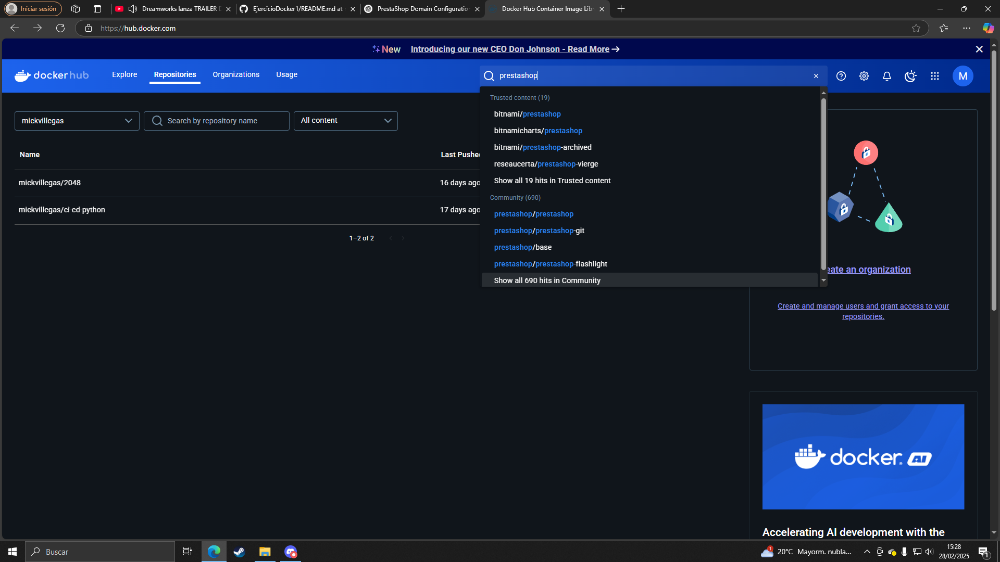
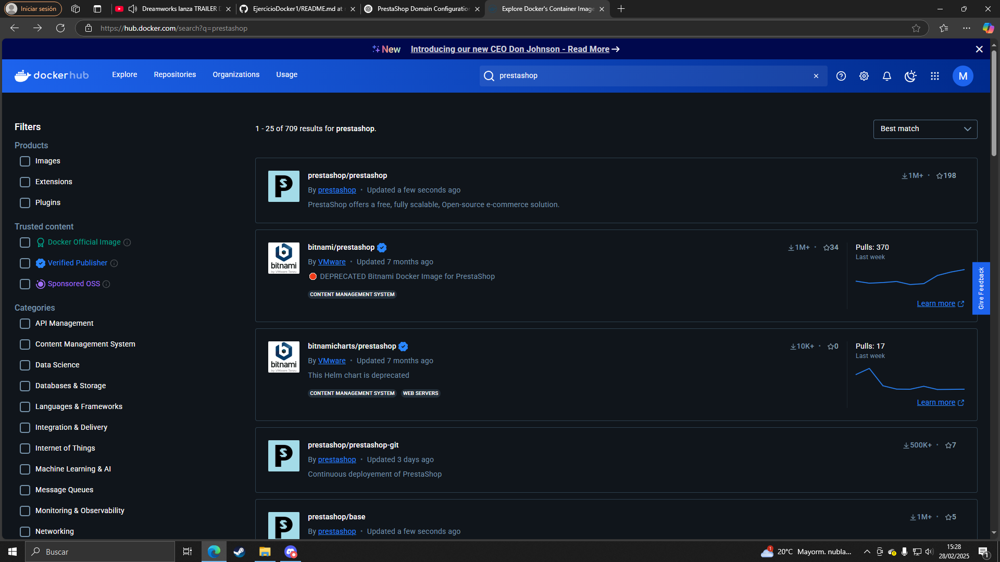
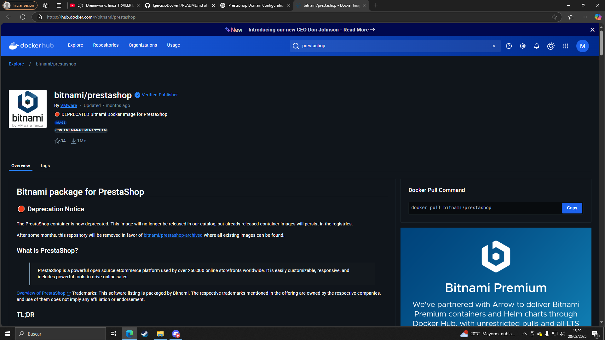
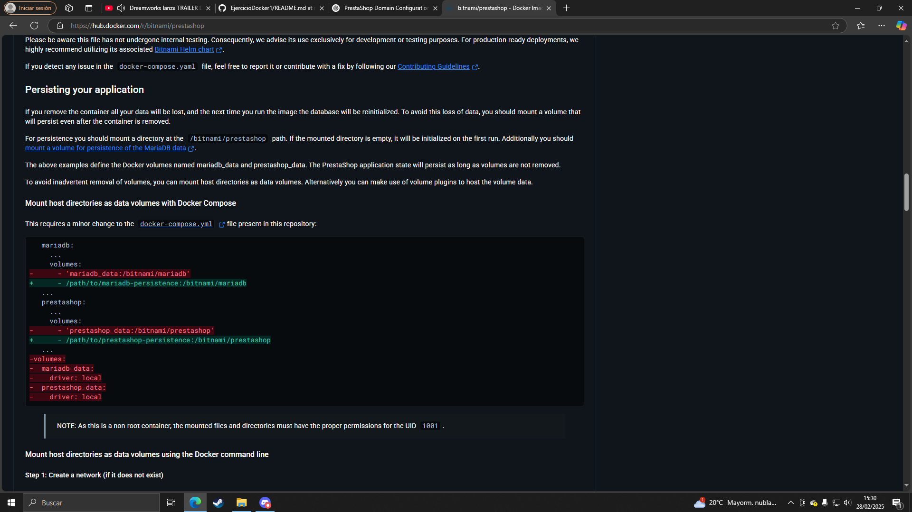
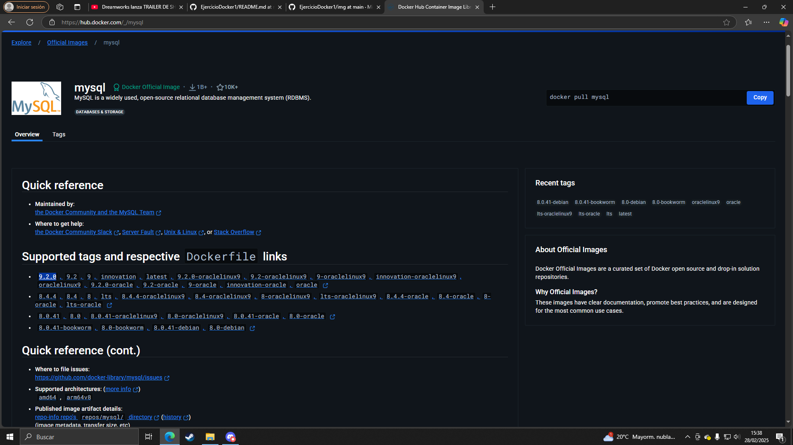
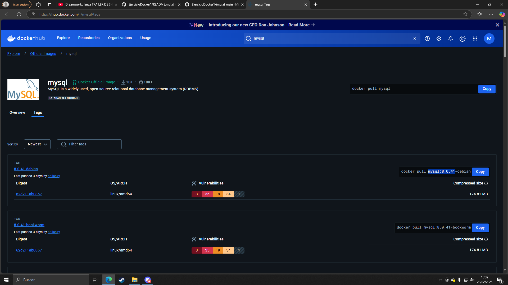
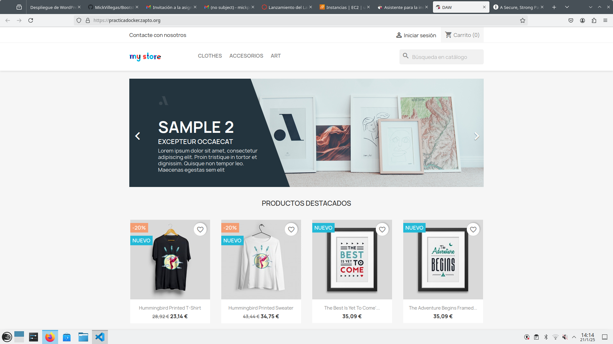

# Despliegue de prestashop y wordpress en Docker

En este readme están documentados tanto el ejercicio de prestashop como el de wordpress.  

Los archivos docker-compose que he creado siguen un mismo patron donde:
- Escrivo la version con version: '3.4'
- Los servicios de las imagenes dockerhub que se van a usar bajo la etiqueta services
- Las redes que usan los servicios con networks
- Los nombres de los volumenes que he creado en volumes 

Para buscar la imagenes he visitado la página de dockerhub, he buscado el nombre de la imagen y he seguido las instrucciones proporcionadas en la descripcion de las imagenes, las siguientes imagenes uso como ejemplo una busqueda de la imagen de prestashop






## Ejercicio Prestashop  

En este ejercicio haremos el despliegue de prestashop con el uso de un docker-compose.yml, para ello debemos hacer uso de las imagenes msql, https portal y phpMyAdmin  

Además uso dos arvhos: 
- El archivo yml
- El archivo .env

En el archivo env se encuentran las variables de entorno que usaré en este ejercicio  

Estas variables serán usadas para:
- La contraseña root de la base de datos
- El nombre de la base de datos
- El nombre de usuario de la base de datos
- La contraseña del usuario de la base de datos
- El dominio del sitio web

```
MYSQL_ROOT_PASSWORD=prestaroot
MYSQL_DATABASE=prestabase
MYSQL_USER=prestauser
MYSQL_PASSWORD=prestapass
DOMAIN=practicadocker.zapto.org
```

### mysql  

Este para este servicio usaremos la imagen de mysql y usarwemos la ultima version, pero en vez de poner "letest" para usar la ultima version directamente escribiremos el numero de versión, que, a fecha en la que se creo la imagen, usaré la version 9.1, asique usaremos la instruccion 
```image: mysql:9.1``` para que docker sepa qué version de la imagen usar y que lo descarge.  

Para saber qué versión usar, he hecho lo siguiente, tras buscar la imagen he escojido en la seccion "Supported tags and respective Dockerfile links" o en la seccion tags 




También necesitamos poner qué puertos escucha para mantener su conexion con el host el cual serán los puertos  3306:3306, el puerto de la derecha es la que escucha el contenedor es el puerto de la izquierda la del host, para escribirlo nuestro de nuestro archivo necesitaremos escribir la instruccion  

```
    ports: 
      - 3306:3306
```

Mysql necesitará que escribamos cual es el nombre de la base de datos, un usuario, una contraseña y otra contraseña para rot, en nuestro archivo tendremos que hacer uso de la etiqueta environment para pasarle los datos que necesita la base de datos para su creación:  

```
    environment: 
      - MYSQL_ROOT_PASSWORD=${MYSQL_ROOT_PASSWORD}
      - MYSQL_DATABASE=${MYSQL_DATABASE}
      - MYSQL_USER=${MYSQL_USER}
      - MYSQL_PASSWORD=${MYSQL_PASSWORD}
```

Aquí he hecho uso de variables de entorno que los tengo guardadas en un archivo .env, para pasarle lñas variables como se muestra se puede poner con el simbolo del dolar y el nombre de la vasiable entre llaves, pero tambien se puede pasarle unstring con la contraseña, usuario, nombre de la base de datos... Pero para mayor seguridad lo he hecho así  

En docker compose podemos asignar un lugar para que los datos se guarden de forma permanente en un directorio del host, para ello se usa la etiqueta volumes donde se le pasa el nombre del volumen " mysql_data" y el directorio deonde se guardan los datos que mysql los debe guardar en el directorio /var/lib/mysql

```
    volumes: 
      - mysql_data:/var/lib/mysql
```

Para decirle qué puertos escucha mysql usamos la etiqueta networks, mysql escuhará la red backend, con lo que la instruccion se verá de la siguiente manera

```
    networks: 
      - backend-network
```

Por ultimo le indicaremos que se reinicie el servicio automaticamente siempre con la instrucción:  

```
restart: always
```

Por lo que el servicio en mysql en nuestro archivo se debe ver de la siguiente manera:  

```
  mysql:
    image: mysql:9.1
    #command: --default-authentication-plugin=mysql_native_password
    ports: 
      - 3306:3306
    environment: 
      - MYSQL_ROOT_PASSWORD=${MYSQL_ROOT_PASSWORD}
      - MYSQL_DATABASE=${MYSQL_DATABASE}
      - MYSQL_USER=${MYSQL_USER}
      - MYSQL_PASSWORD=${MYSQL_PASSWORD}
    volumes: 
      - mysql_data:/var/lib/mysql
    networks: 
      - backend-network
    restart: always
```

### phpMyAdmin  

Pasra configurar el servicio haremos lo siguiente  
La imagen que usaré, a fecha en la que hice este archivo, será la ultima que es la version 5.2.1 de phpMyAdmin y usaré la etiqueta image para decirle a docker qué versio ntiene que usar  

```
image: phpmyadmin:5.2.1
```

phpMy admin se comunicará con el host con los puertos 8080:80  

```
    ports:
      - 8080:80
```

Además este servicio está conectado a dos redes, la red frontend y la red backend  

```
    networks: 
      - backend-network
      - frontend-network
```

Y le decimos que siempre se reinicie de forma automatica

```
restart: always
```

phpMyAdmin depende del funcionameiento de mysql, para decirle a docker que este servicio depende del correcto funcionamiento del servicio mysql para funcionar usaremos la etiqueta depends_on y el nombre del servicio:   

```
    depends_on: 
      - mysql
```

El servicio de phpMyAdmin devbería verse de la siguiente manera:  

```
  phpmyadmin:
    image: phpmyadmin:5.2.1
    ports:
      - 8080:80
    environment: 
      - PMA_ARBITRARY=1
    networks: 
      - backend-network
      - frontend-network
    restart: always
    depends_on: 
      - mysql
```

### Prestashop  

Para este servicio hemos usado la version prestashop/prestashop:8 de la imagen de prestashon:  

```
image: prestashop/prestashop:8
```

Prestashop necesita saber qué servicio de base de datos es el que estamos usando, o el server de base de datos, en este caso estamos usando mysql, para que docker lo interprete lo especificaremos en la etiqueta enviorements y esta vez he pasado el dato por string  

```
    environment: 
      - DB_SERVER=mysql
```

Además haremos los datos permanentes en el directorio /var/www/html

```
    volumes:
      - prestashop_data:/var/www/html
```

Prestashop se copnecta en la red frontent y backend  

```
    networks: 
      - backend-network
      - frontend-network
```

Por ultimo le decimos que el servicio depende del funcionamiento de mysql para que funcione y que se reinicia siempre  

```
    restart: always
    depends_on: 
      - mysql
```

Por lo que la configuraciondel servicio de prestashop se debe ver de la siguiente manera  

```
  prestashop:
    image: prestashop/prestashop:8
    environment: 
      - DB_SERVER=mysql
    volumes:
      - prestashop_data:/var/www/html
    networks: 
      - backend-network
      - frontend-network
    restart: always
    depends_on: 
      - mysql
````

### Httpos portal

Para este servicio usaremos la imagen steveltn/https-portal:1, además escuchará con será los puertos 80:80 y 443:443, el servicio siempre se reiniciará, en enviorements necesitaremos escribir cual es el dominio de nuestro prestashop, el cual será http://prestashop:80", este se guardará en la etiqueta domains al que tambien se le pasa nuestra variable de entorno domains  

```
DOMAINS: "$DOMAIN -> http://prestashop:80"
```
la variable $DOMAIN -> será reemplazada por el dominio, ademñas http://prestashop:80 es para que el dominio apunte al servicio dfe nuestro prestashop corriendo en el puerto 80.
Además pondremos ``` STAGE: 'production'``` indica que el entorno se va a ejecutar etá configurado como produccion

Por ultimo le decimos que se conecta a la red frontend.
Nuestro sdervicio de https portal se debería verse de la siguiente manera  

```
  https-portal:
    image: steveltn/https-portal:1
    ports:
      - 80:80
      - 443:443
    restart: always
    environment:
      DOMAINS: "$DOMAIN -> http://prestashop:80"
      STAGE: 'production' # Don't use production until staging works
      # FORCE_RENEW: 'true'
    networks:
      - frontend-network
```

Al final del archivo debemos poner aquellos servicios que usan volumenes para guardar sus datros y las redes con los que nlos servicios se conectan, estas instrucciones deben ser las siguientes

```
volumes:
  mysql_data:
  prestashop_data:

networks: 
  backend-network:
  frontend-network:
```

El resultado fianl de todo nuestro archivo docker compose tiene que ser el siguiente  

```
version: '3.4'

services:
  mysql:
    image: mysql:9.1
    #command: --default-authentication-plugin=mysql_native_password
    ports: 
      - 3306:3306
    environment: 
      - MYSQL_ROOT_PASSWORD=${MYSQL_ROOT_PASSWORD}
      - MYSQL_DATABASE=${MYSQL_DATABASE}
      - MYSQL_USER=${MYSQL_USER}
      - MYSQL_PASSWORD=${MYSQL_PASSWORD}
    volumes: 
      - mysql_data:/var/lib/mysql
    networks: 
      - backend-network
    restart: always
  
  phpmyadmin:
    image: phpmyadmin:5.2.1
    ports:
      - 8080:80
    environment: 
      - PMA_ARBITRARY=1
    networks: 
      - backend-network
      - frontend-network
    restart: always
    depends_on: 
      - mysql

  prestashop:
    image: prestashop/prestashop:8
    environment: 
      - DB_SERVER=mysql
    volumes:
      - prestashop_data:/var/www/html
    networks: 
      - backend-network
      - frontend-network
    restart: always
    depends_on: 
      - mysql

  https-portal:
    image: steveltn/https-portal:1
    ports:
      - 80:80
      - 443:443
    restart: always
    environment:
      DOMAINS: "$DOMAIN -> http://prestashop:80"
      STAGE: 'production' # Don't use production until staging works
      # FORCE_RENEW: 'true'
    networks:
      - frontend-network

volumes:
  mysql_data:
  prestashop_data:

networks: 
  backend-network:
  frontend-network:
```

Si buscamos en internet el nombre de nuestro dominio podremos ver prestashop desplegado donde tendremos que registrarnos 



## Ejercicio Workpress

En este ejercicio haremos uso de los servicios mysql, phpadmin, http y wordpress para el despliegue de un wordpress  

Además uso dos arvhos: 
- El archivo yml
- El archivo .env

En el archivo env se encuentran las variables de entorno que usaré en este ejercicio  

Estas variables serán usadas para:
- La contraseña root de la base de datos
- El nombre de la base de datos
- El nombre de usuario de la base de datos
- La contraseña del usuario de la base de datos
- El dominio del sitio web

```
WORDPRESS_DB_HOST=mariadb
WORDPRESS_DB_USER=admin
WORDPRESS_DB_PASSWORD=admin
WORDPRESS_DB_NAME=wordpressdb
DOMAIN=practicadocker.zapto.org
```

### Mysql
La configuracion para mysql será el siguiente  

```
 mysql:
    image: mysql:9.0
    ports: 
      - 3306:3306
    environment: 
      - MYSQL_ROOT_PASSWORD=$MYSQL_ROOT_PASSWORD
      - MYSQL_DATABASE=$MYSQL_DATABASE
      - MYSQL_USER=$MYSQL_USER
      - MYSQL_PASSWORD=$MYSQL_PASSWORD
    volumes: 
      - mysql_data:/var/lib/mysql
    networks: 
      - backend-network
    restart: always
```

donde  image: mysql:9.0 es la version de la imagen mysql, la version que se usará es la version 9.0, en  ports: - 3306:3306 especificamos el puerto que va a usar, en este caso el 3306:3306, en environment: le pasamos las variables de entorno donde le pasaremos la contraseña root, el nombre de base de datos, el usuario y la contraseña, para pasarle las variables de entorno en un archivo .env suaremos como siempre el simbolo del dolar y el nombre de la variable. Despues bienen los volumenes, que es donde se almacenaran de forma permanente los datos, tras esto en networks: que es la red con la que se conectará, esn esta vez se conectará en el backend, por ultimo nos encontramos con restart always, que indica que mmysql siempre se reiniciará automaticamente

### phpmyadmin
El codigo de php es el siguiente  

```
  phpmyadmin:
    image: phpmyadmin:5.2.1
    ports:
      - 8080:80
    environment: 
      - PMA_ARBITRARY=1
    networks: 
      - backend-network
      - frontend-network
    restart: always
    depends_on: 
      - mysql
```
Usaremos la version 5.2.1 de la imagen, los puertos que usara será el 8080:80 las  variabñles de entorno environment: - PMA_ARBITRARY=1, las redes con las que se conectaran será tanto el frontend como el backend y rse reiniciara automaticamente siempre, ademas en depends_on: - mysql le estamos diciendo que php depende de que el servicio mysql para que funcione

### wordpress
Configuracion de wordpress  

```
  wordpress:
    image: bitnami/wordpress:6.7.1
    ports:
      - 80:8080 
    environment:
      - WORDPRESS_DATABASE_HOST=mysql
      - WORDPRESS_DATABASE_USER=$MYSQL_USER
      - WORDPRESS_DATABASE_PASSWORD=$MYSQL_PASSWORD
      - WORDPRESS_DATABASE_NAME=$MYSQL_DATABASE
    volumes:
      - wordpress:/var/www/html
    depends_on:
      - mysql
    networks: 
      - backend-network
      - frontend-network
    restart: always
```

Donde la imagen será bitnami/wordpress:6.7.1, el puerto sera el 80:8080, las variables de entorno serán en WORDPRESS_DATABASE_HOST=mysql, WORDPRESS_DATABASE_USER=el usuario de mysql, WORDPRESS_DATABASE_PASSWORD= la contraseña de mysql, WORDPRESS_DATABASE_NAME= el nombre de la base de datos de mysql, el volumen (el lugar donde se guardan los datos) serán en wordpress:/var/www/html, tambien dependerá de mysql, y las redes con las que se conectan será el backend y el frontent y se reiniciará siempre.

Al final del contenedor nos creamos volumes donde se encontrarán las imagenes que estamos usando y que guardan datos permanentes, serán mysql_data y wordpress  y en networks ponemos las redes que estamos usando en este contenedor, frontend y backend, de esta forma  

```
volumes:
  mysql_data:
  wordpress:

networks: 
  backend-network:
  frontend-network:
```

De esta manera, nuestro archivo se debe ver asi  

```
version: '3.4'
services:
  mysql:
    image: mysql:9.0
    ports: 
      - 3306:3306
    environment: 
      - MYSQL_ROOT_PASSWORD=$MYSQL_ROOT_PASSWORD
      - MYSQL_DATABASE=$MYSQL_DATABASE
      - MYSQL_USER=$MYSQL_USER
      - MYSQL_PASSWORD=$MYSQL_PASSWORD
    volumes: 
      - mysql_data:/var/lib/mysql
    networks: 
      - backend-network
    restart: always
  
  phpmyadmin:
    image: phpmyadmin:5.2.1
    ports:
      - 8080:80
    environment: 
      - PMA_ARBITRARY=1
    networks: 
      - backend-network
      - frontend-network
    restart: always
    depends_on: 
      - mysql

#cosas que he visto 
  wordpress:
    image: bitnami/wordpress:6.7.1
    ports:
      - 80:8080 #lo quitas despues del https
    environment:
      - WORDPRESS_DATABASE_HOST=mysql
      - WORDPRESS_DATABASE_USER=$MYSQL_USER
      - WORDPRESS_DATABASE_PASSWORD=$MYSQL_PASSWORD
      - WORDPRESS_DATABASE_NAME=$MYSQL_DATABASE
    volumes:
      - wordpress:/var/www/html
    depends_on:
      - mysql
    networks: 
      - backend-network
      - frontend-network
    restart: always

volumes:
  mysql_data:
  wordpress:

networks: 
  backend-network:
  frontend-network:
```
Vamos a hacer un docker compose up -d para ver si funciona bien (levantamos el contenedor en segundo plano)

Una vez hecho buscamos en nuestro buscador nuestra ip sin https, entonces nos encontraremos en nuestro wordpress 


### http portal
Ahora configuraremos el servicio http, lo haremos de la siguiente manera  
Primero quitaremos el puerto en el servicio wordpress y despues añadiremos lo siguiente en el servicio http  

```
  https-portal:
    image: steveltn/https-portal:1
    ports:
      - 80:80
      - 443:443
    restart: always
    environment:
      DOMAINS: "$DOMAIN -> http:///wordpress:8080"
      STAGE: 'production' 
    networks:
      - frontend-network
```

la version de la imagen es teveltn/https-portal:1, sus puertos serán 80:80 443:443 se reiniciara automaticamente siempre, sus variables de entorno será DOMAINS: "$DOMAIN -> http:///wordpress:8080"donde indicamos nuestro dominio, aquí he usado mi nombre de dominio usando la variable del .env y las redes con el que se conecta es el frontend, de esta forma el archivo se verá así


```
version: '3.4'
services:
  mysql:
    image: mysql:9.0
    ports: 
      - 3306:3306
    environment: 
      - MYSQL_ROOT_PASSWORD=$MYSQL_ROOT_PASSWORD
      - MYSQL_DATABASE=$MYSQL_DATABASE
      - MYSQL_USER=$MYSQL_USER
      - MYSQL_PASSWORD=$MYSQL_PASSWORD
    volumes: 
      - mysql_data:/var/lib/mysql
    networks: 
      - backend-network
    restart: always
  
  phpmyadmin:
    image: phpmyadmin:5.2.1
    ports:
      - 8080:80
    environment: 
      - PMA_ARBITRARY=1
    networks: 
      - backend-network
      - frontend-network
    restart: always
    depends_on: 
      - mysql

  wordpress:
    image: bitnami/wordpress:6.7.1
    ports:
      - 80:8080 #lo quitas despues del https
    environment:
      - WORDPRESS_DATABASE_HOST=mysql
      - WORDPRESS_DATABASE_USER=$MYSQL_USER
      - WORDPRESS_DATABASE_PASSWORD=$MYSQL_PASSWORD
      - WORDPRESS_DATABASE_NAME=$MYSQL_DATABASE
    volumes:
      - wordpress:/var/www/html
    depends_on:
      - mysql
    networks: 
      - backend-network
      - frontend-network
    restart: always

  #https-portal:
   # image: steveltn/https-portal:1
    #ports:
    #  - 80:80
    #  - 443:443
    #restart: always
    #environment:
    #  DOMAINS: "$DOMAIN -> http:///wordpress:8080"
     # STAGE: 'production' 
    #networks:
    #  - frontend-network

volumes:
  mysql_data:
  wordpress:

networks: 
  backend-network:
  frontend-network:
```
ahora si buscamos nuestro nombre de dominio el resultado es el siguiente  


